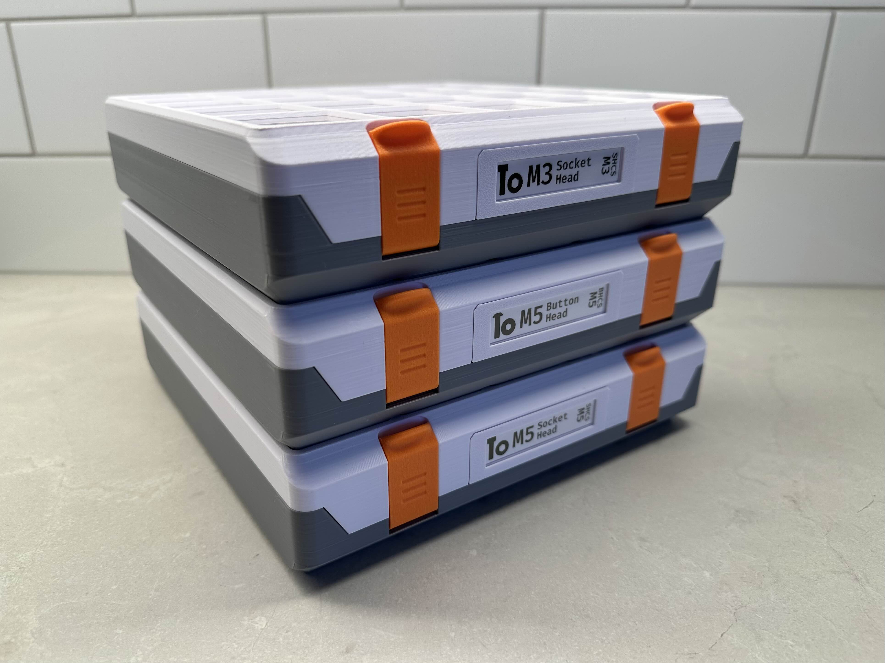
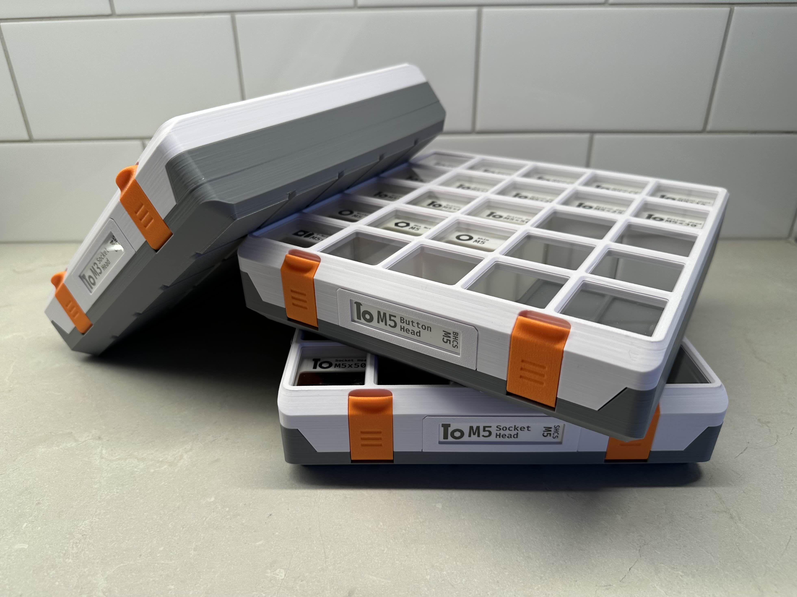
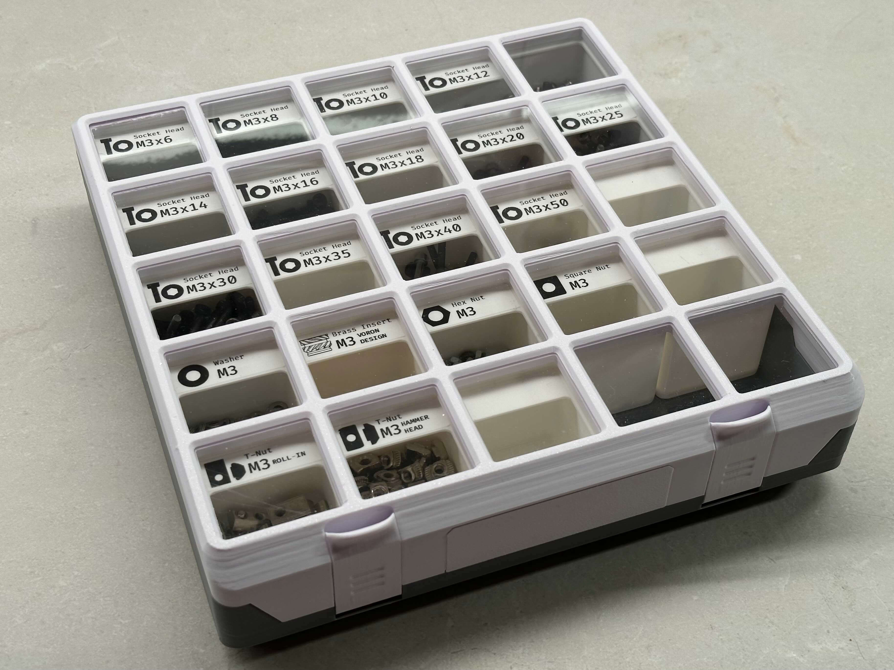

# Component Icons and Labels for Gridfinity

A growing collection of pre-made labels and icons for various small parts. Originally designed for Gridfinity storage bins, but flexible to suit your needs.

## Need-to-know

- **Label Maker Used:** Brother P-Touch Cube 750BT
- **Label Size:** 12mm
- **Font:** [Fira Code (Medium, Semibold) by tonsky](https://github.com/tonsky/FiraCode)

## Attribution

Ella Fox [Printables](https://www.printables.com/@ellafoxo) | [GitHub](https://github.com/ellafoxo)

Erik Reynolds [Printables](https://printables.com/@erikbuild) | [GitHub](https://github.com/erikbuild)

## License

Creative Commons Attribution Share-Alike 4.0

